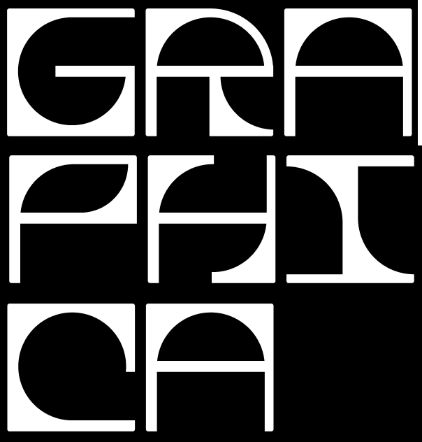
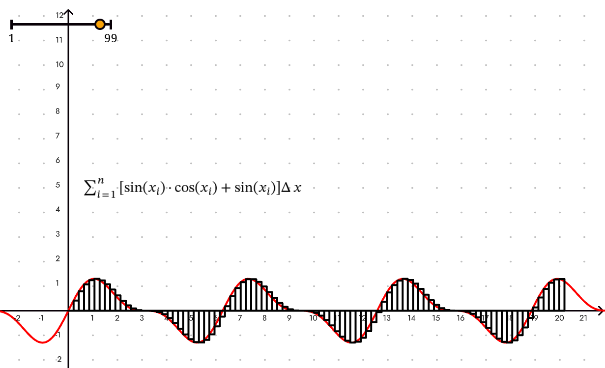

# Graphica

> A graphical library used for visualising mathematical concepts



## Getting Started

First, build the project with parcel. You will need to start a live server yourself on the `./index.html` file:

```bash
yarn dev
```

Alternatively, you can build the project with webpack:

```bash
yarn dist
```

To run prettier use:

```bash
yarn prettier
```

Or to run both prettier and eslint use:

```bash
yarn lint
```
